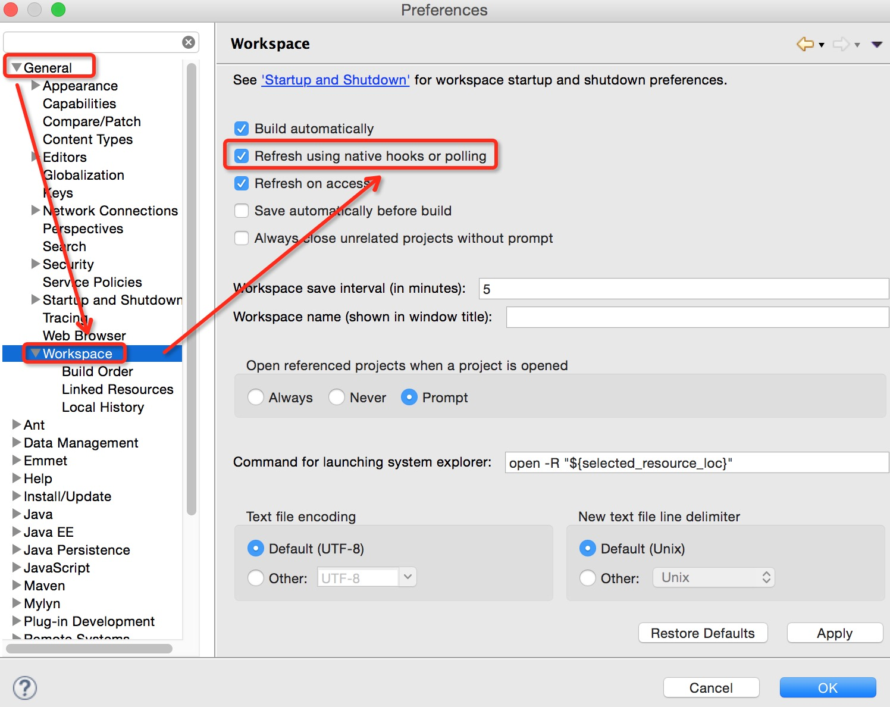

#使用Grunt同步Eclipse工作区间

#1. 问题

##1.1 环境

* 前端：使用 Webstorm、Git/Github，开发项目 app1
* 后端：使用 Eclipse、SVN，开发项目 web1

##1.2 难点

* app1 和 web1 在不同的位置 且 使用不同的版本控制系统
* app1的持续开发与修改需要同步到web1
* 实时刷新运行中的web1

#2. 方案

##2.1 同步

使用Grunt自动clean（清理）、copy（拷贝）、watch（监控）

##2.2 实时刷新

打开Eclipse的实时刷新，一旦本地文件发送变化就刷新（有3秒左右的延迟）

#3. 步骤

#3.1 Grunt

###3.1.1 插件

* grunt-contrib-clean
* grunt-contrib-copy
* grunt-contrib-watch

###3.1.2 copy

将app1拷贝到 web1 的指定目录

	copy: {
            app: {
                files: [
                    {
                        expand: true,
                        cwd: 'dev/apps/bafw',
                        src: ["css/**","images/*.{png,jpg,gif}","js/main.js"],
                        dest: '/Users/forwardNow/develop/workspace/gdbaweb/WebRoot/static/web/'
                    }
                ]
            }
            ,
            htmls: {
                files: [
                    {
                        expand: true,
                        cwd: 'dev/apps/bafw',
                        src: ["index.html"],
                        dest: '/Users/forwardNow/develop/workspace/gdbaweb/WebRoot/static/web/'
                    }
                ]
            },
            scripts: {
                files: [
                    {
                        expand: true,
                        cwd: 'dev/apps/bafw',
                        src: ["js/main.js"],
                        dest: '/Users/forwardNow/develop/workspace/gdbaweb/WebRoot/static/web/'
                    }
                ]
            },
            styles: {
                files: [
                    {
                        expand: true,
                        cwd: 'dev/apps/bafw',
                        src: ["css/style.css"],
                        dest: '/Users/forwardNow/develop/workspace/gdbaweb/WebRoot/static/web/'
                    }
                ]
            }
    }

###3.1.3 watch

当app1的文件发生变化时，将变化的文件（覆盖）拷贝到web1

	watch: {
            htmls: {
                files: ['dev/apps/bafw/index.html'],
                tasks: ['copy:htmls']
            },
            scripts: {
                files: ['dev/apps/bafw/js/main.js'],
                tasks: ['copy:scripts']
            },
            styles: {
                files: ['dev/apps/bafw/css/style.css'],
                tasks: ['copy:styles']
            }
    }

#3.2 Eclipse

当本地文件发生变化时，进行刷新

