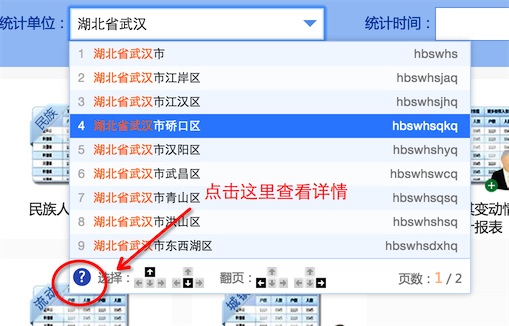

#下拉字典控件




##1. 说明

###1.1 相关文件

	modules
		|-- jquery
			|-- jquery-1.9.0.js
		|-- ui
			|-- autocomplete.js
			|-- css
				|-- autocomplete.css		
			|-- images
				|-- autocomplete_help.jpg	
				
###1.2 兼容性

* 主流浏览器
* IE7+				
				
###1.3 注意

* \<input ... data-code=“字典值code”>
* \<input ... value =“显示的文本text”>
* \<input ... data-dic-trigger="#btn-trigger"> 额外的触发器
* \<input ... data-dic-clean="#btn-clean"> 指定清空按钮
* 选定记录以及触发blur事件都会更新 data-code属性的值
* 输入项校验可基于 data-code属性		
		

				
##2. 使用

* HTML

```
<input type="text" id="testAC"
       data-dic-src="./DIC_CODE.xml"
       data-dic-trigger="#btn-trigger"
       data-dic-clean="#btn-clean"
        />
<button type="button" id="btn-trigger">触发</button>
<button type="button" id="btn-clean">清空</button>
```

* 试试
	* 点击这里：

```
<input type="text" id="testAC" data-dic-src="./DIC_CODE.xml"/>
<script data-main="../../../../../dev/modules/" src="../../../../../dev/modules/require.js"></script>
<script>
        var VERSION;
//         VERSION = "v2.0";
        require.config( {
            urlArgs: "VERSION=" + ( VERSION || (new Date()).getTime()),
            map: {
                '*': {
                    'css': 'utils/css/css'
                }
            },
            shim: {
                'ui/autocomplete': ["css!ui/css/autocomplete.css", 'jquery/jquery-1.9.0']
            },
            waitSeconds: 15
        } );
        require(["ui/autocomplete"], function () {

            //$( "#testAC" ).autocompleteDic();

        } );
</script>
```

